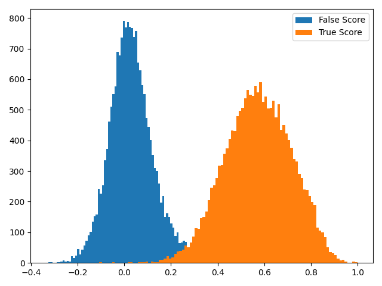

# HCSI speaker

A Speaker Recognition toolkit, which contains the implementation of popular speaker recognition algorithms in pytorch.

## Installation

```bash
git clone https://github.com/thuhcsi/torch_speaker
cd torch_speaker
pip install -r requirements.txt
python setup.py develop
```

## Visualization

<div align="center">
  
</div>

## Research

## Runtime

## Reference

### code

### paper
